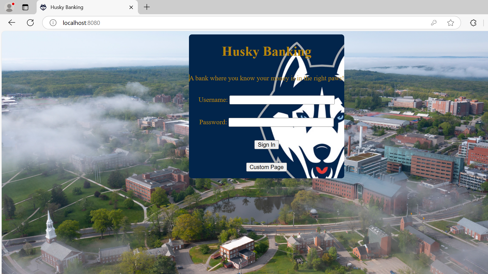
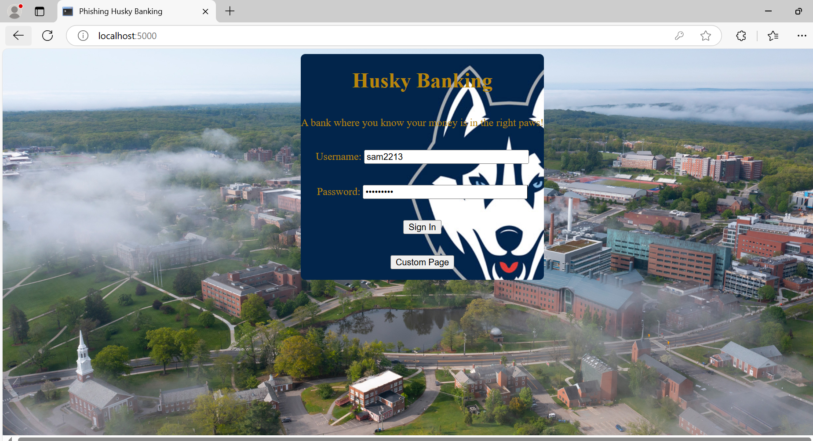

# Phishing Site Attack

  <!-- Official Hosted Bank Site -->
  

    
Official Hosted Bank Site

  

  <!-- Fake/Phishing Site -->
  

    
    
Remade Fake/Phishing Site

  

---
Unsuspecting users' keystrokes and credentials are logged and saved in "Logged-Credentials.txt" file unknowingly. 
While maintaining official banking site's functionality.
